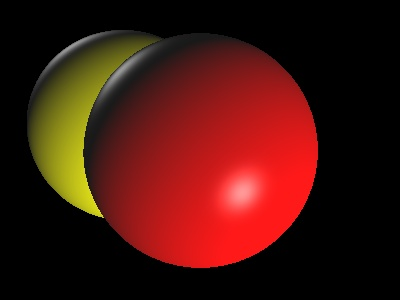

# NewBie Ray Tracer
Building a basic ray tracer for the newb (me).

## Compiling
It's been tested on Mac OS X with clang602.0.503. 
Should work on Linux as well.

### Dependencies
* OpenCV (2.4.9)
* GLM (0.9.7) - included in the ext folder

### Steps to build
* Install OpenCV to the usual libs location on your \*nix. 
* Add the path to the Makefile.
* Run _make_ in the newb\_ray folder.

## Running
* Create the scene in the  main.cpp file. Right now, there's no external scene format.
* Recompile and run

## Json sample
	{
		"models": [
			{
				"type" : "sphere",
				"radius" : 4.0,
				"center" : [0.0, 0.0, 10.0],
				"material" : {
					"color"  : {
						"diffuse" : [1.0, 0.0, 0.0],
						"specular" : [0.5, 0.5, 0.5],
						"ambient" : [0.1, 0.1, 0.1]
					}
				}
			},
			{
				"type" : "sphere",
				"radius" : 4.0,
				"center" : [-3.0, -1.0, 12.0],
				"material" : {
					"color"  : {
						"diffuse" : [1.0, 1.0, 0.0],
						"specular" : [0.5, 0.5, 0.5],
						"ambient" : [0.1, 0.1, 0.1]
					}
				}
			}

		],
		"params": {
			"xRes" : 400,
			"yRes" : 300,
			"planeDistance": 5.0,
			"fieldOfViewY" : 45.0,
			"aspectRatio": 1.3333,
			"cameraPosition": [0.0, 0.0, 0.0],
			"cameraUp": [0.0, 1.0, 0.0],
			"cameraTarget": [0.0, 0.0, 10.0],
			"maxDepth": 4
		}
	}

